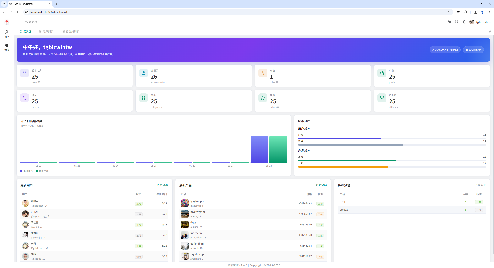

# Laravel Modeler Admin

Laravel Modeler Admin 是一个基于 Laravel + Element Plus 的后台管理模板，帮助开发者快速构建一致、可维护的后台系统。

项目提供完整的后台基础结构，包括模块化组织、权限控制、表单页面、列表管理、接口规范。通过可视化模型设计与生成器能力，开发者可以专注于业务逻辑，而不是重复编写 CRUD 代码。

---

## 界面截图



---

## 特性

- Laravel 13 + Vue 3 + Element Plus
- TypeScript 支持
- 基于`laravel/sanctum`的用户鉴权
- 基于`nwidart/laravel-modules`的模块化后台结构
- 居于`spatie/laravel-permission`的权限控制与菜单管理
- 基于`dedoc/scramble`的OPENAPI RESTful API 生成
- 基于`light2000/laravel-modeler`的Model设计与migrations管理

---

## 技术栈

### 后端

- PHP 8.3+
- Laravel 13+
- MySQL / PostgreSQL
- Laravel Modules
- Laravel Permission
- Laravel Modeler

### 前端

- Vue 3
- TypeScript
- Element Plus
- Pinia
- Vue Router
- Axios

---

## 项目结构

```txt
modeler-admin/
├─ backend/          # Laravel 后端
├─ admin/            # Element Plus 前端
└─ README.md
```

---

## 快速开始

### 1. 克隆项目

```bash
git clone https://github.com/light2000/laravel-modeler-admin.git
```

---

### 2. 安装后端依赖

```bash
cd backend

composer install
cp .env.example .env

php artisan key:generate
php artisan migrate --seed
php artisan storage:link
php artisan serve
```

---

### 3. 安装前端依赖

```bash
cd ../admin

pnpm install
pnpm gen:api
pnpm dev
```

---

## 使用场景

适用于：

- 企业后台
- ERP
- CMS
- 电商管理系统
- SaaS 后台
- 内部运营平台

---

## License

MIT
